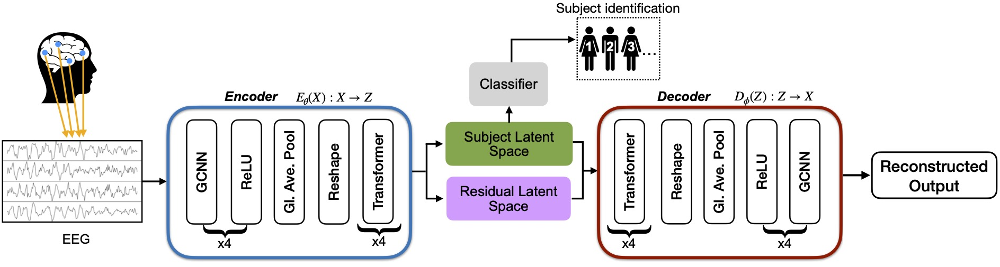

# GC-VASE: Graph Convolutional Variational Autoencoder for Subject Representation Learning from EEG
> Subject Representation Learning from EEG using Graph Convolutional Variational Autoencoders [IEEE-ICASSP 2025]
>  [Publication](https://ieeexplore.ieee.org/abstract/document/10890073) | [arXiv](https://arxiv.org/abs/2501.16626)

## Introduction
> We propose GC-VASE, a graph convolutional-based variational autoencoder that leverages contrastive learning for subject representation learning from EEG data. Our method successfully learns robust subject-specific latent representations using the split-latent space architecture tailored for subject identification. To enhance the model's adaptability to unseen subjects without extensive retraining, we introduce an attention-based adapter network for fine-tuning, which reduces the computational cost of adapting the model to new subjects. Experiments demonstrate that our method significantly outperforms other deep learning approaches, achieving state-of-the-art results with a subject balanced accuracy of 89.81% and 70.85% on the ERP-Core and SleepEDFx-20 datasets, respectively. After subject adaptive fine-tuning, GC-VASE further improves the subject balanced accuracy to 90.31% on ERP-Core. Additionally, we perform a detailed ablation study to highlight the impact of the key components of our method.

## Model Architecture

>The proposed GC-VASE model incorporates a split latent space. The encoder splits the latent space into subject-specific space and residual latent space that are subsequently used for subject and task classification through an XGB classifier.

## t-SNE Plot

>t-SNE plots of split-latents encoded on the test set (unseen subjects), colored by their true labels. The plots, in order, depict: subject space colored by subject, subject space colored by task, task space colored by task, and task space colored by subject.

## Results

>Table 1: Subject identification and task classification balanced accuracies (%) on the ERP-Core dataset

| Model     | Subject Identification - Subject latent | Subject Identification - Residual latent | Task classification - Residual latent | Task classification - Subject latent |
|-----------|------------------------------------------|-------------------------------------------|----------------------------------------|---------------------------------------|
| **CSLP-AE** | 80.32                                   | 79.64                                     | **48.48**                              | 45.41                                 |
| **SLP-AE**  | 74.63                                   | 74.70                                     | 47.00                                  | 47.23                                 |
| **C-AE**    | 79.42                                   | 73.27                                     | 46.59                                  | 37.34                                 |
| **AE**      | 60.68                                   | 61.08                                     | 31.43                                  | 31.62                                 |
| **GC-VASE** | **89.81**                               | 85.40                                     | 36.18                                  | 31.83                                 |

>Table 2: Ablation study on the impact of major components in GC-VASE for subject identification on ERP-Core

| Variants                 | F1-score (%)        | Accuracy (%)       |
|--------------------------|---------------------|--------------------|
| **GC-VASE**              | **89.58**           | **89.81**          |
| w/o GCNN                 | 81.04 (↓ 8.54)      | 81.73 (↓ 8.08)     |
| w/o contrastive learning | 80.18 (↓ 9.40)      | 80.84 (↓ 8.97)     |
| w/o split-latent         | 81.51 (↓ 8.07)      | 81.72 (↓ 8.02)     |

>Table 3: Subject identification and task classification balanced accuracies (%) on SleepEDFx-20 with 20 subjects

| Model      | Split Latent | Subject Identification - Sub. latent | Subject Identification - Res. latent | Task classification - Res. latent | Task classification - Sub. latent |
|------------|--------------|---------------------------------------|---------------------------------------|------------------------------------|------------------------------------|
| **CNN**    | No           | 67.18                                | -                                     | -                                  | -                                  |
| **LaBraM** | No           | 59.42                                | -                                     | -                                  | -                                  |
| **CSLP-AE**| Yes          | 67.55                                | 67.18                                 | 34.91                              | 34.48                              |
| **GC-VASE**| Yes          | **70.85**                            | 70.60                                 | **46.19**                          | 45.91                              |


## Requirements
Use the `requirements.txt` file to install all the necessary libraries. Execute the following command:

```bash
pip install -r requirements.txt
```

## Data Pre-processing
- The first step is data preparation. Begin by downloading the dataset, ensuring the folder structure remains unaltered. The dataset can be obtained from the [ERP-CORE repository](https://osf.io/thsqg/). Within the `data_preparation` directory, the `create_dataset.py` script processes the data to generate a Pickle file containing all examples, along with their corresponding subject and task labels. You can execute the script using the following command:

```bash
python erp_core.py
```

- Use the `sleepedfx.py` in the `SleepEDFx` folder for pre-processing the [SleepEDFx](https://www.physionet.org/content/sleep-edfx/1.0.0/) database. It can be implemented by the following command:

```bash
python sleepedfx.py
```

## Reproducing Training Results

The `gc_vase` directory contains code for the GC-VASE variant and the `ft_gc_vase` directory contains the subject adaptive fine-tuned version of GC-VASE using adapters and attention layers.

- To train the GC-VASE model run the following command:

```bash
python train.py --sub_contra_s_enabled 1 --task_contra_t_enabled 1 --latent_permute_s_enabled 1 --latent_permute_t_enabled 1 
```

- To train the GC-VASE model without contrastive learning run the following command:

```bash
python train.py --latent_permute_s_enabled 1 --latent_permute_t_enabled 1 
```

- To train the GC-VASE model with Autoencoder (AE replacing VAE) run the following command:

```bash
python train.py --recon_enabled 1 
```
- To train the GC-VASE model with a single latent space run the following command:

```bash
python train-org.py --sub_cross_s_enabled 1 --task_cross_t_enabled 1 --epochs 1 
```

- To train the GC-VASE model without GCNN layers, edit the `split_model.py` and change the number of GCNN layers to `0`.

## Running the Evaluation Script

To evaluate the model's performance run the following command:

```bash
python eval.py --model_path model-name.pt --data_dir ./ --data_line simple 
```
## Citation
If you find this research work useful, please consider citing:

```bash
@inproceedings{mishra2025subject,
  title={Subject Representation Learning from EEG using Graph Convolutional Variational Autoencoders},
  author={Mishra, Aditya and Samin, Ahnaf Mozib and Etemad, Ali and Hashemi, Javad},
  booktitle={ICASSP 2025-2025 IEEE International Conference on Acoustics, Speech and Signal Processing (ICASSP)},
  pages={1--5},
  year={2025},
  organization={IEEE}
}
```

## Acknowledgement
This research was supported by [Mitacs GRI 2024](https://www.mitacs.ca/our-programs/globalink-research-internship-students/) program.

